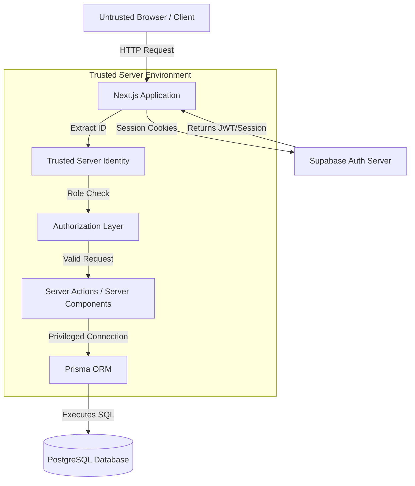

# SRK Security Architecture

This document describes the security trust boundaries, authentication, and authorization architecture of the SRK platform.

## Trust Boundary Diagram

## Security Layers

### 1. Authentication (Supabase Auth)
- **Mechanism:** Supabase handles all credential verification, hashing, and session generation. 
- **Session Transport:** Sessions are stored in HTTP-only, Secure cookies managed by `@supabase/ssr`.
- **Untrusted Input:** The application **never** trusts client-provided identity assertions (e.g., passing a `userId` in a request body). The identity is exclusively verified by calling `supabase.auth.getUser()` on the server.

### 2. Authorization (Application Layer)
- **Role Verification:** Currently, roles are implicitly tested (i.e. if the user has a valid session, they are a student). Future Admin/College roles must be queried from the `User.role` field in the database.
- **Resource Ownership:** The application enforces IDOR protection by filtering database queries against the trusted session ID. 
  - *Example Pattern:* `prisma.registration.findUnique({ where: { userId_workshopId: { userId: trustedUserId, ... } } })`.

### 3. Database Access & Supabase RLS
- **Prisma's Role:** Prisma connects to the PostgreSQL database using a privileged connection string (`DATABASE_URL`).
- **RLS Bypass Rationale:** Because Prisma operates using a connection that often defaults to `postgres` or a highly privileged role, **Supabase Row Level Security (RLS) is effectively bypassed**.
- **Defense in Depth:** The application relies entirely on the **Application Authorization Layer** (Server Actions & Components) to secure data. Every Prisma query must include programmatic checks for ownership and role validation.

## Secrets Management

- **Public Keys:** `NEXT_PUBLIC_SUPABASE_URL` and `NEXT_PUBLIC_SUPABASE_ANON_KEY` are safe to expose to the browser and are required for the Supabase Auth client to function.
- **Private Keys:** `DATABASE_URL` and `DIRECT_URL` are strictly server-only.
- **Service Role:** The `SUPABASE_SERVICE_ROLE_KEY` is currently not used. If introduced for administrative bypasses, it **must never** be prefixed with `NEXT_PUBLIC_`.
